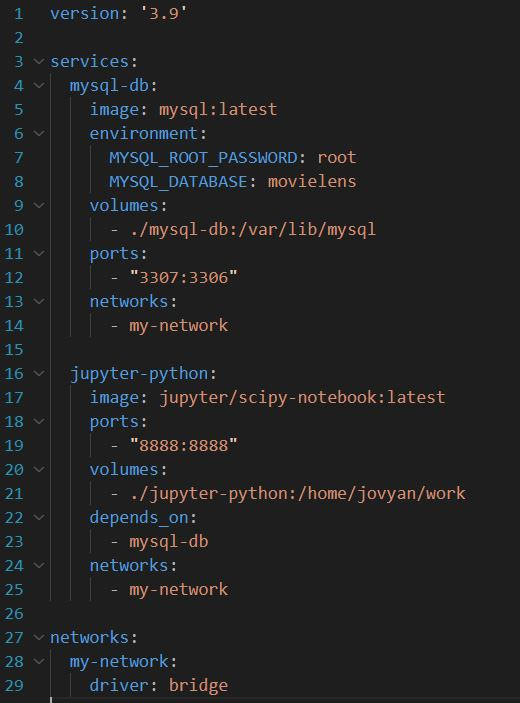

# data_engineering_docker_project

## Table of Contents
- [Introduction](#introduction)
- [Installation](#installation)
- [Docker_compose_setup](#docker_compose_setup)
- [Importing_data_to_MySQL_DB](#importing_data_to_MySQL_DB)
- [Data_extraction](#data_extraction)

## Introduction
This `data_engineering_docker_project` is my first experience with Docker. It leverages MySQL as the database and Jupyter notebooks with Python for data analysis and transformation.

## Installation
After installing docker on my computer I installed mysql:latest image and jupyter/scipy-notebook:latest image through the command line with 'docker pull' command.

## Docker_compose_setup
The next step was to write a docker-compose.yml. After moving to the project directory in cmd and executing 'docker-compose up' command two containers were created. One with mysql and the other one with jupyter notebook. Mysql container was connected to the 3307 host port because 3306 was already occupied. The .yml file ensures that the database is running before starting jupyter. 

## Importing_data_to_MySQL_DB
Because I already had MySQL Workbench GUI installed on my computer I used it to establish a connection with mysql database in a container. Consequently I imported data from .csv files using built-in Data Import Wizard to the database but unfortunately due to unknown reason only a small part of movies.csv file was uploaded. The were no issues with the rest of the files.

## Data_extraction
The next and the last phase of the project was to answer 6 questions by querying and transforming data from the database. I used python, pandas and mysql-connector to achieve that. Before using jupyter notebook in the docker container I had to search for a token in container logs ('docker logs <container_name>') and then after connecting to the localhost 8888 port I had to input that token to gain access. Afterward I imported necessary libraries and established a connection with the database. From that point on I could query the DB and get the information that I needed.
[View PDF of the jupyter notebook](./data_extraction.pdf)